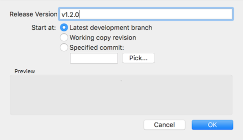
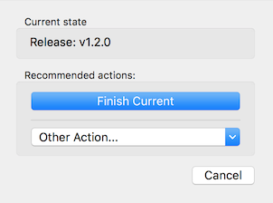

# Release Process for `sbt-site`

## Branch Management

This project uses [GitFlow](https://www.atlassian.com/git/tutorials/comparing-workflows/gitflow-workflow)
for branch management. This means that PRs should be merged onto `develop`, not `master`. New releases are prepared 
from a `release/vX.Y.Z` branch, and `master` is only updated from `release/...` branches (there are also `hotfix` 
branches, but they aren't common).

An easy way to use GitFlow is to make use of the support built-in to the [SourceTree](https://www.sourcetreeapp.com) 
frontend which includes support for GitFlow. The images below are taken from SourceTree. There are 
[other ways to use GitFlow](http://danielkummer.github.io/git-flow-cheatsheet/) if you don't want to use SourceTree.

## Releass

0. Make sure you have [BinTray](https://bintray.com/sbt) credentials for the "sbt" organization. You won't be able to 
publish without them.
1. Make sure the working directory is clean and up-to-date with the remote, and the tests pass (e.g. `sbt scripted`). 
Some people like to run `git clean -fdx`.
2. Start the release branch process:  
    
  Give the release branch a version name with the form `v<X>.<Y>.<Z>`:  
    
  You should now be on the release branch:  
  
3. Create the file `notes/<X>.<Y>.<Z>.markdown` (the long-form extension is necessary for announcing the release with `herald`). 
Sometimes this file already exists if PR submitters are super awesome. Go through the commit logs and collect the major 
new features, bug fixes, deprecations, and anything else relevant to users. Making note of breaking changes is particularly 
important. See previous release notes for format/content conventions. 
4. Edit the `version` setting in `build.sbt` to match `"<X>.<Y>.<Z>"`
5. Commit your current changes onto the release branch.  
  
6. Run `sbt bintrayWhoami` to confirm your publishing credentials are set up. [See sbt documentation](http://www.scala-sbt.org/0.13/docs/Bintray-For-Plugins.html) on how to get set up with Bintray.
7. Run `sbt publish` to build the packages and stage artifacts on Bintray. 
8. Confirm the plugin is properly [staged for release on Bintray](https://bintray.com/sbt/sbt-plugin-releases/sbt-site/view).
You should see a message that looks looks like this:  
  
9. Run `sbt bintrayRelease`. This moves the plugin from the staged release to published release on Bintray.
10. Finish release per GitFlow process:  
    
    
  Push changes.
11. Create a [release entry](https://github.com/sbt/sbt-site/releases/new) in GitHub
13. Monitor the [TravicCI build](https://travis-ci.org/sbt/sbt-site) and make sure it [updates the manual](http://www.scala-sbt.org/sbt-site/getting-started.html) with the latest version.
12. Announce release using [`herald`](https://github.com/n8han/herald). Also announce release on Twitter, including `#scala` 
and `@scala_sbt` and major contributor handles (if available).
13. On the `develop` branch, edit the `version` setting in `build.sbt` to match `"<X>.<Y+1>.0-SNAPSHOT"`. Commit and push.

